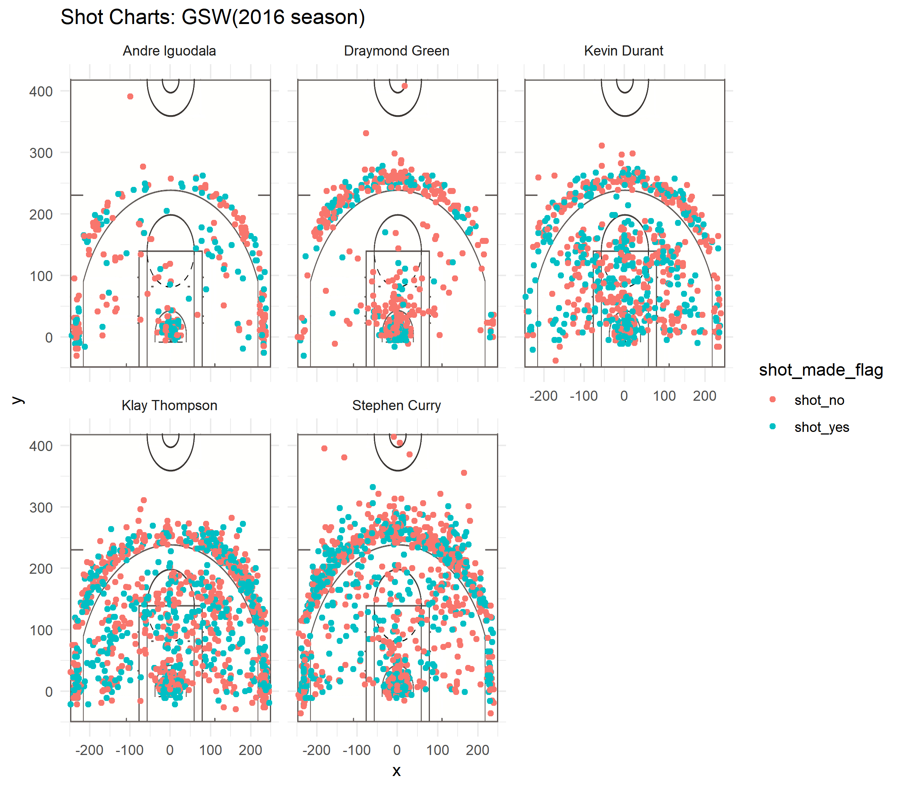
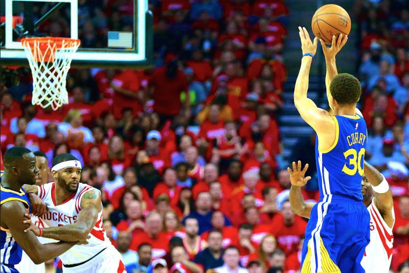

```{r include=FALSE}
library(dplyr)
```
```{r echo=FALSE}
column_types <- c("character", "character", "character", "integer", "integer",
                  "integer", "integer", "character", "factor", "factor", 
                  "integer", "factor", "real", "real", "character", "integer")
df <- read.csv("../data/shots-data.csv", row.names = 1, 
               stringsAsFactors = FALSE, header = TRUE,
               sep = ",", colClasses = column_types)
```

# Introduction

The 2015–16 Golden State Warriors season was the 70th season of the franchise in the National Basketball Association (NBA), and its 54th in the San Francisco Bay Area. The Warriors entered the season as the defending NBA champions and they set the best ever regular-season record of 73–9, breaking the 1995–96 Chicago Bulls record of 72–10. Golden State broke over twenty-five NBA records and more than ten franchise records that season, including most wins ever recorded in a season (regular-season and postseason combined); with 88. This team's regular season is considered to be one of the greatest in NBA and professional sports history.

In this project, we collect the shooting data of five GSW players: Andre Iguodala, Graymond Green, Kevin Durant, Klay Thompson, Stephen Curry. We focus on the field goal percentage of these five players and conclude that Stephen Curry is the best shoot in GSW.

# Analysis

Here is a facetted shot chart for five players.


```{r out.width='80%', echo=FALSE, fig.align='center'}


```


From the above shot chart, we can roughly see that Stephen Curry and Klay Thompson made more shoot. Although Stephen Curry made a little bit less second-point shoot than Klay Thompson, Curry made more third-point shoot! Now let's look at the data more specifically.

Here is the summary table for 2-point shooting.

```{r echo=FALSE, comment=""}
second_pt_summary <- summarise(
  group_by(df, name), 
  total = sum(shot_type == '2PT Field Goal'), 
  made = sum(shot_type == '2PT Field Goal' & shot_made_flag == 'shot_yes'),
  percentage = made/total)
second_pt_summary <- arrange(second_pt_summary, desc(percentage))
second_pt_summary
```

Well, as I said before, Curry did make a little bit less second-point shoot than Klay Thompson. And from the above table, we can see that although Iguodala made least 2-point shooting, his shooting is most effective, 0.638! Durant also has a high efficiency, achieving 0.607.

Now, let's take a look at 3-point shooting.

```{r echo=FALSE, comment=""}
third_pt_summary <- summarise(
  group_by(df, name), 
  total = sum(shot_type == '3PT Field Goal'), 
  made = sum(shot_type == '3PT Field Goal' & shot_made_flag == 'shot_yes'),
  percentage = made/total)
third_pt_summary <- arrange(third_pt_summary, desc(percentage))
third_pt_summary
```

Now, it's time for Curry to show his greatness! Although Curry's effective percentage is a little lower than Thompson, but he made more field goal. There is no doubt that his field goals are much more than others. 



Last, but not the least, let's look at the overall shooting summary.

```{r comment="", echo=FALSE}
shoot_summary <- summarise(
  group_by(df, name), 
  total = length(shot_made_flag), 
  made = sum(shot_made_flag == 'shot_yes'),
  percentage = made/total)
shoot_summary <- arrange(shoot_summary, desc(percentage))
shoot_summary
```

From the above chart, we know why Curry has been the best shooter in GSW! Curry made 584 field goals during entire season, breaking his own record, and making the largest contribution to warriors!

# Reference
[1]“2015–16 Golden State Warriors Season.” Wikipedia, Wikimedia Foundation, 19 Feb. 2019, en.wikipedia.org/wiki/2015–16_Golden_State_Warriors_season.

[2]Kitano, Hugo. “Ranking Golden State's Shooters, Part 3.” Golden State Of Mind, Golden State Of Mind, 24 Aug. 2017, www.goldenstateofmind.com/2017/8/24/16182404/nba-2017-ranking-golden-state-shooters-part-2-young-casspi-durant-thompson-curry.