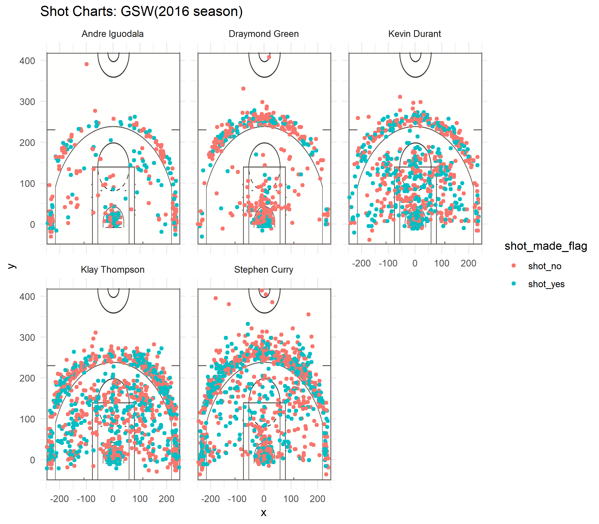
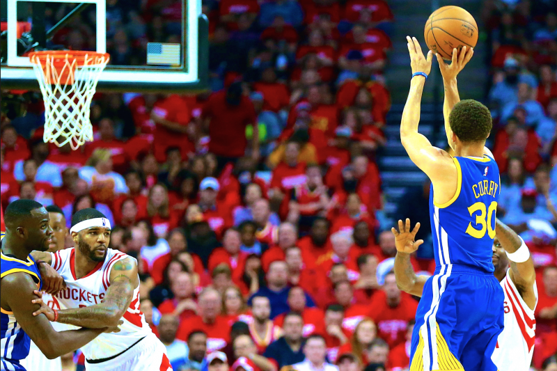

Stephen Curry, the Best Shooter in GSW
================
Yingxi Yang

Introduction
============

The 2015–16 Golden State Warriors season was the 70th season of the franchise in the National Basketball Association (NBA), and its 54th in the San Francisco Bay Area. The Warriors entered the season as the defending NBA champions and they set the best ever regular-season record of 73–9, breaking the 1995–96 Chicago Bulls record of 72–10. Golden State broke over twenty-five NBA records and more than ten franchise records that season, including most wins ever recorded in a season (regular-season and postseason combined); with 88. This team's regular season is considered to be one of the greatest in NBA and professional sports history.

In this project, we collect the shooting data of five GSW players: Andre Iguodala, Graymond Green, Kevin Durant, Klay Thompson, Stephen Curry. We focus on the field goal percentage of these five players and conclude that Stephen Curry is the best shoot in GSW.

Analysis
========

Here is a facetted shot chart for five players.

From the above shot chart, we can roughly see that Stephen Curry and Klay Thompson made more shoot. Although Stephen Curry made a little bit less second-point shoot than Klay Thompson, Curry made more third-point shoot! Now let's look at the data more specifically.

Here is the summary table for 2-point shooting.

    # A tibble: 5 x 4
      name           total  made percentage
      <chr>          <int> <int>      <dbl>
    1 Andre Iguodala   210   134      0.638
    2 Kevin Durant     643   390      0.607
    3 Stephen Curry    563   304      0.540
    4 Klay Thompson    640   329      0.514
    5 Draymond Green   346   171      0.494

Well, as I said before, Curry did make a little bit less second-point shoot than Klay Thompson. And from the above table, we can see that although Iguodala made least 2-point shooting, his shooting is most effective, 0.638! Durant also has a high efficiency, achieving 0.607.

Now, let's take a look at 3-point shooting.

    # A tibble: 5 x 4
      name           total  made percentage
      <chr>          <int> <int>      <dbl>
    1 Klay Thompson    580   246      0.424
    2 Stephen Curry    687   280      0.408
    3 Kevin Durant     272   105      0.386
    4 Andre Iguodala   161    58      0.360
    5 Draymond Green   232    74      0.319

Now, it's time for Curry to show his greatness! Although Curry's effective percentage is a little lower than Thompson, but he made more field goal. There is no doubt that his field goals are much more than others.

Last, but not the least, let's look at the overall shooting summary.

    # A tibble: 5 x 4
      name           total  made percentage
      <chr>          <int> <int>      <dbl>
    1 Kevin Durant     915   495      0.541
    2 Andre Iguodala   371   192      0.518
    3 Klay Thompson   1220   575      0.471
    4 Stephen Curry   1250   584      0.467
    5 Draymond Green   578   245      0.424

From the above chart, we know why Curry has been the best shooter in GSW! Curry made 584 field goals during entire season, breaking his own record, and making the largest contribution to warriors!

Reference
=========

\[1\]“2015–16 Golden State Warriors Season.” Wikipedia, Wikimedia Foundation, 19 Feb. 2019, en.wikipedia.org/wiki/2015–16\_Golden\_State\_Warriors\_season.

\[2\]Kitano, Hugo. “Ranking Golden State's Shooters, Part 3.” Golden State Of Mind, Golden State Of Mind, 24 Aug. 2017, www.goldenstateofmind.com/2017/8/24/16182404/nba-2017-ranking-golden-state-shooters-part-2-young-casspi-durant-thompson-curry.
